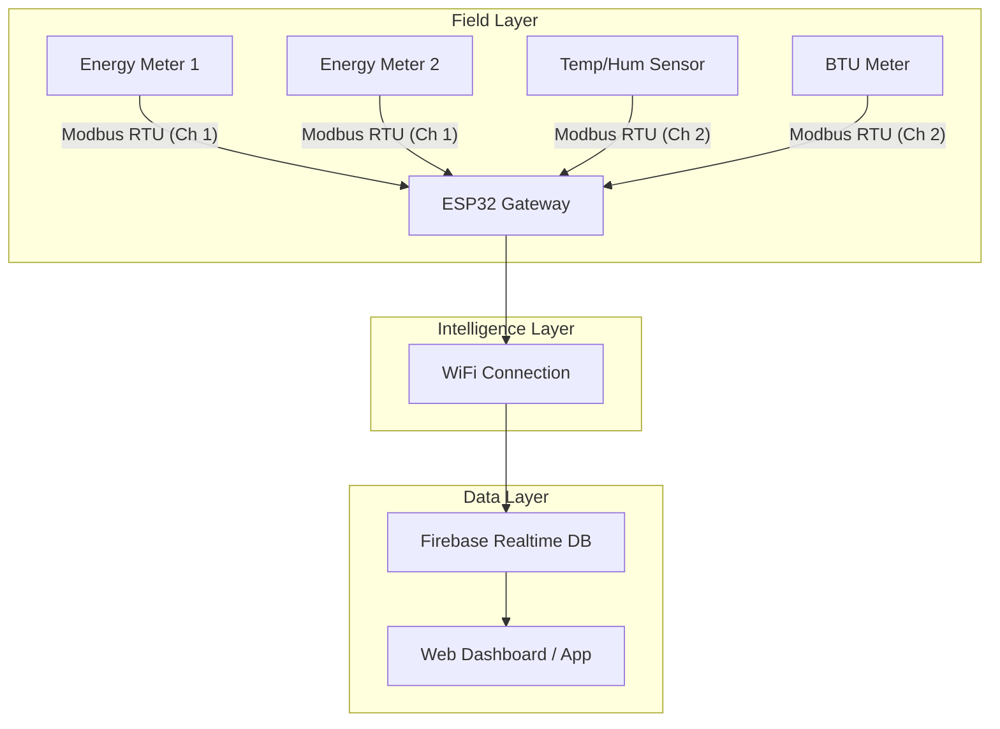
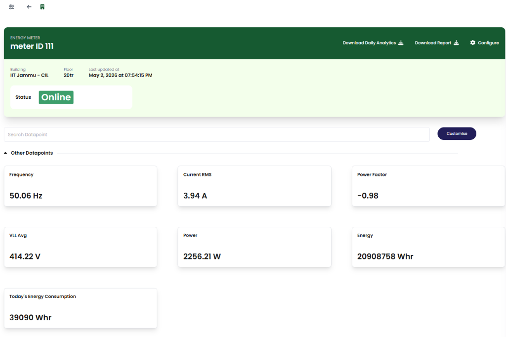
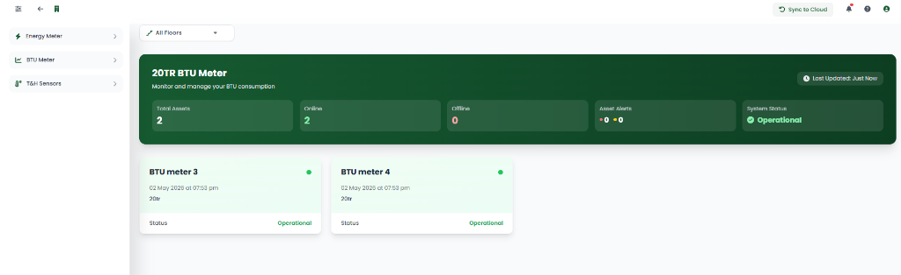
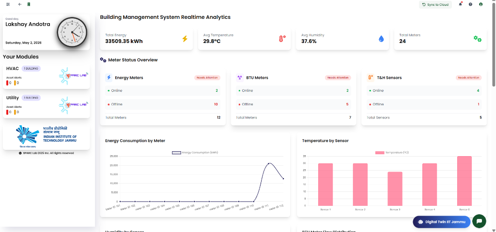

# ⚡ Modbus-Based IoT Energy & BTU Monitoring System

[](https://platformio.org/)
[](https://www.espressif.com/en/products/socs/esp32)
[](https://firebase.google.com/)
[](https://opensource.org/licenses/MIT)

A scalable, industrial-grade monitoring system designed for Building Management Systems (BMS) and HVAC applications. This firmware collects electrical and thermal data via **Modbus RTU** using an ESP32 and pushes real-time analytics to **Firebase Cloud**.

---

## 🚀 Key Features

*   **Multi-Channel Modbus RTU**: Independent handling of Energy Meters and Environmental Sensors.
*   **Real-Time Cloud Sync**: Seamless integration with Firebase Realtime Database.
*   **Scalable Architecture**: Modular PlatformIO codebase for easy expansion to hundreds of nodes.
*   **Precision Timekeeping**: NTP-based ISO 8601 timestamping for all data points.
*   **Robust Error Handling**: Integrated Modbus communication diagnostics and offline device detection.

---

## 🧠 System Architecture



---

## 🛠 Hardware Specifications

| Component | Role | Pins (ESP32) |
| :--- | :--- | :--- |
| **ESP32** | Main Controller | - |
| **MAX485 (Ch 1)** | Energy Meter Interface | RX:21, TX:19, DE:25, RE:26 |
| **MAX485 (Ch 2)** | Sensor/BTU Interface | RX:16, TX:17, DE:4, RE:2 |
| **Energy Meters** | Electrical Monitoring | Modbus Slave 101, 102 |
| **TH Sensors** | Climate Monitoring | Modbus Slave 1-5 |

---

## 📂 Project Structure

```text
.
├── include/
│   └── config.h          # Global configuration (WiFi, Firebase, Pins)
├── src/
│   ├── main.cpp          # Application orchestration
│   ├── modbus_handler.cpp# Modbus communication logic
│   ├── cloud_handler.cpp # WiFi, Firebase & NTP logic
│   └── ...
├── platformio.ini        # Dependency management & build settings
└── README.md             # Documentation
```

---

## 📊 Dashboard Visualization

Real-time monitoring and analytics provided by the cloud dashboard:

| Overview | Energy Analytics | BTU Monitoring |
| :---: | :---: | :---: |
|  |  |  |

---

## 🔧 Getting Started

### 1. Prerequisites
*   Install [VS Code](https://code.visualstudio.com/)
*   Install [PlatformIO IDE extension](https://platformio.org/install/ide/vscode)

### 2. Configuration
Edit `include/config.h` to update your credentials:
```cpp
const char* WIFI_SSID     = "YOUR_SSID";
const char* WIFI_PASSWORD = "YOUR_PASSWORD";
#define FIREBASE_REFERENCE_URL "https://your-project.firebaseio.com"
```

### 3. Build & Upload
1.  Connect your ESP32.
2.  Click the **PlatformIO: Build** icon.
3.  Click the **PlatformIO: Upload** icon.
4.  Open the Serial Monitor (9600 baud) to view logs.

---

## 📊 Data Schema
Data is pushed to Firebase in the following structure:
```json
{
  "energyMeters": {
    "meterH11": {
      "energy": 1234.5,
      "watts": 250.0,
      "timestamp": "2024-05-02T16:00:00Z"
    }
  }
}
```

---

## 📄 License
This project is licensed under the MIT License - see the [LICENSE](LICENSE) file for details.

## 👨‍💻 Author
**Lakshay Gandotra**  
*IoT & Embedded Systems Engineer*  
[GitHub](https://github.com/laksh890)